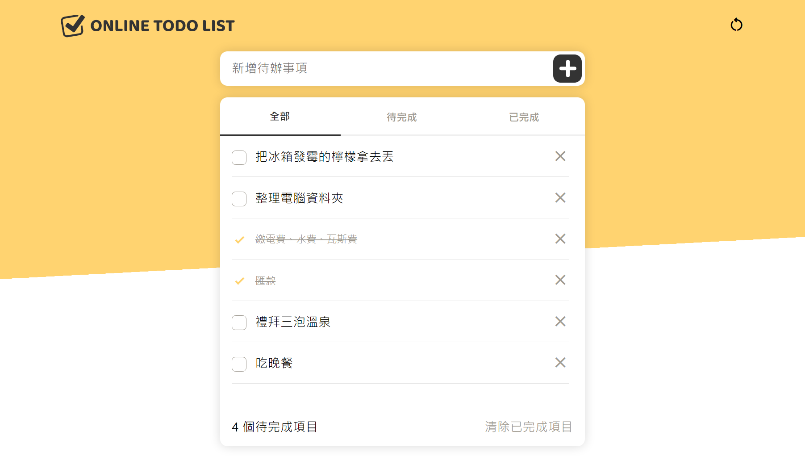
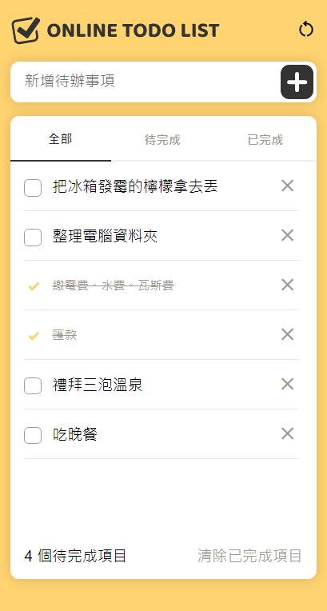

# react-todolist-newbie

- React 新手證書任務：

> <https://rpg.hexschool.com/task/356/show>

- 設計稿：

> <https://www.figma.com/file/pFivfS3rDX3N3u3dN9aIlx/>

---

## NOTES

- 練習 styled-components、prop-types

- 按鈕用 CSS 畫出十字符號、打勾用 CSS 客製化

- 頁面高度 `100vh`、直向捲軸移至卡片內

- 資料同時存進 `localStorage`、另外增加 `RESET` 按鈕來重置

- 分頁切換顯示 `filter` 過後的資料

- 點選文字能開始編輯，按鍵盤 `ENTER` 存檔、`ESC` 是取消

---

## 功能

- [x] 需使用 React 框架來挑戰

- [x] 新增待辦功能
- [x] 移除待辦功能
- [x] 清除已完成項目
- [x] 確認待完成項目總數 （幾個待完成項目）

- [x] 切換待辦狀態（打勾表示已完成、未勾表示待完成）
- [x] 狀態頁籤切換功能（全部、待完成、已完成）

- [x] 待辦為零筆資料時，需顯示文字「目前尚無待辦事項」

---

## Screenshot

> 
>
> 

---

## React + Vite

This template provides a minimal setup to get React working in Vite with HMR and some ESLint rules.

Currently, two official plugins are available:

- [@vitejs/plugin-react](https://github.com/vitejs/vite-plugin-react/blob/main/packages/plugin-react/README.md) uses [Babel](https://babeljs.io/) for Fast Refresh
- [@vitejs/plugin-react-swc](https://github.com/vitejs/vite-plugin-react-swc) uses [SWC](https://swc.rs/) for Fast Refresh
